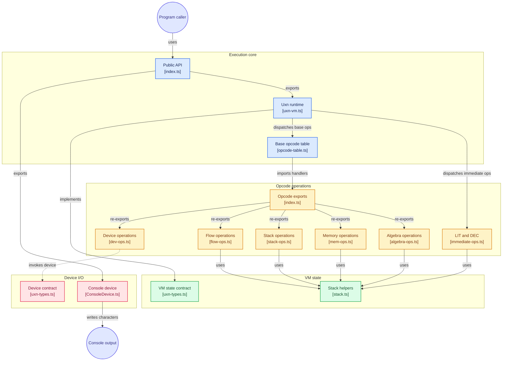

# Примеры

В этом каталоге собраны примеры запуска виртуальной машины Uxn. Примеры
показывают, как связать публичный API библиотеки с исполнением байт-кода в RAM
и как устройства обеспечивают ввод-вывод.

Текущий пример: `hello.ts` — выводит строку `Hello` через консольное устройство
и отдельно демонстрирует опкод декремента.

> ℹ️ **О чём этот документ.** Подробный разбор примера `hello.ts`: что именно
> происходит при запуске, какие зависимости и объекты API задействованы, какие
> опкоды выполняются и почему выбран каждый из них.

## Содержание

- [Как запустить](#как-запустить)
- [Что происходит при запуске](#что-происходит-при-запуске)
- [Используемые зависимости и API](#используемые-зависимости-и-api)
- [Разбор `hello.ts` по шагам](#разбор-hellots-по-шагам)
- [Используемые опкоды и почему именно они](#используемые-опкоды-и-почему-именно-они)
- [Ожидаемый вывод](#ожидаемый-вывод)
- [Схема потока данных](#схема-потока-данных)

## Как запустить

```bash
npm install        # установка зависимостей (typescript, @types/node)
npm run build      # компиляция TypeScript в dist/
npm start          # сборка + запуск примера: node dist/examples/hello.js
```

Отдельно, без пересборки:

```bash
node dist/examples/hello.js
```

Пример написан как ES-модуль (`"type": "module"` в `package.json`), поэтому
запускается через `node`, а не через `require`.

## Что происходит при запуске

1. Создаётся устройство `ConsoleDevice` (реализация интерфейса `Device`).
2. Создаётся ВМ `Uxn`, которой это устройство передаётся в конструктор.
3. Байт-код программы вручную копируется в RAM по адресу входа `0x0100`.
4. Вызывается `vm.run(0x0100)` — ВМ выполняет опкоды до `BRK`.
5. Во время выполнения опкод `DEO` вызывает `ConsoleDevice.deo`, который печатает
   символ в stdout.
6. После остановки печатается финальное значение счётчика команд (PC).

Ключевая идея: **пример не содержит логики интерпретатора** — вся она в
библиотеке. Пример только формирует байт-код, кладёт его в память и подключает
устройство.

> 💡 Публичный API минимален: достаточно `new Uxn(device)`, нескольких записей в
> `vm.ram` и одного вызова `vm.run(pc)`.

## Используемые зависимости и API

### Внешние зависимости

| Зависимость | Тип | Зачем нужна |
|-------------|-----|-------------|
| `typescript` | dev | компиляция `.ts` в `.js` (`tsc`, цель ES2022, модули NodeNext) |
| `@types/node` | dev | типы для `process`, `node:url` (используются в примере) |
| `node:url` (встроенный модуль) | runtime | `pathToFileURL` — определение точки входа |

Других рантайм-зависимостей нет: интерпретатор ВМ самодостаточен.

### Публичный API

Пример импортирует объекты **напрямую из модулей** `src/`, а не из барреля
`index.ts`. Причина — запуск из каталога `examples/` и наглядность: видно, откуда
именно берётся каждая сущность. Баррель `src/index.ts` предоставляет то же самое
для внешних потребителей.

| Импорт в примере | Модуль | Назначение |
|------------------|--------|------------|
| `Uxn` | `../src/uxn-vm.js` | класс виртуальной машины: RAM, стеки, `run()` |
| `ConsoleDevice` | `../src/ConsoleDevice.js` | устройство вывода символов в консоль |
| `pathToFileURL` | `node:url` | проверка, что файл запущен как точка входа |

Эти же сущности доступны из барреля:

```ts
import { Uxn, ConsoleDevice } from 'vmjs';   // эквивалент через src/index.ts
```

### Что даёт каждый объект API

`Uxn` (реализует `VMState`):

- `vm.ram: Uint8Array(65536)` — память программ и данных;
- `vm.stack: Stack` — рабочий (data) стек: `{ data: Uint8Array(256), index }`;
- `vm.ret: Stack` — стек возвратов;
- `vm.dev: Uint8Array(256)` — 256 байт портов устройств;
- `vm.device: Device` — подключённое устройство;
- `vm.run(pc): number` — выполнять опкоды с адреса `pc` до `BRK`, вернуть PC.

`ConsoleDevice` (реализует `Device`):

- `deo(vm, target): boolean` — вызывается ВМ при записи в порт; при `target === 0x18`
  печатает `vm.dev[target]` в stdout и возвращает `true` (продолжать);
- `dei(vm, target): void` — чтение порта (в примере не используется, обнуляет порт).

Интерфейс `Device` заставляет устройство иметь ровно два метода — `dei` и `deo`,
что позволяет подключать любую периферию (экран, клавиатуру, аудио) без изменений
в самой ВМ.

## Разбор `hello.ts` по шагам

### Шаг 1. Подключение устройства и создание ВМ

```ts
const device = new ConsoleDevice();
const vm = new Uxn(device);
```

Конструктор `Uxn` выделяет память: 64 КБ RAM, два стека по 256 байт, 256 байт
портов. Устройство сохраняется в `vm.device` и в дальнейшем используется
опкодами `DEI`/`DEO`.

### Шаг 2. Формирование байт-кода

```ts
const ADDR_CONSOLE = 0x18;
const OP_LIT = 0x80;
const OP_DEO = 0x17;
const OP_BRK = 0x00;

function emitChar(char: number): number[] {
    return [
        OP_LIT, ADDR_CONSOLE,  // addr устройства консоли
        OP_LIT, char,          // код символа
        OP_DEO,
    ];
}
```

`emitChar` возвращает 5 байт: два литерала и запись в устройство. Порядок
литералов важен (см. следующий шаг).

### Шаг 3. Почему addr кладётся первым

Опкод `DEO` снимает со стека **сначала значение, затем адрес**: реализация в
`src/opcodes/dev-ops.ts` делает `popByte` для value, потом для addr. Поэтому на
стек нужно положить адрес первым, а код символа — вторым, чтобы символ оказался
на вершине:

```
стек после emitChar(0x48):  [0x18, 0x48]   адрес ниже, значение на вершине
DEO выталкивает:            value=0x48, addr=0x18
```

### Шаг 4. Сборка программы и загрузка в RAM

```ts
const program: number[] = [
    ...emitChar(0x48),  // 'H'
    ...emitChar(0x65),  // 'e'
    ...emitChar(0x6c),  // 'l'
    ...emitChar(0x6c),  // 'l'
    ...emitChar(0x6f),  // 'o'
    OP_BRK,
];

program.forEach((byte, i) => {
    vm.ram[0x0100 + i] = byte;
});
```

Адрес `0x0100` — стандартная точка входа в ROM-область памяти Uxn. Пример сам
пишет байты в `vm.ram`, минуя какой-либо файл-образ: так проще показать связь
между байт-кодом и состоянием ВМ.

### Шаг 5. Запуск

```ts
const finalPc = vm.run(0x0100);
```

`run` циклически читает байт по `pc`, диспетчеризует его через таблицу опкодов и
двигает PC, пока не встретит `BRK` (возвращает `null`). Метод возвращает итоговый
PC.

### Шаг 6. Демонстрация `DEC`

```ts
const decProgram: number[] = [ OP_LIT, 0x41, OP_DEC, OP_BRK ];
decProgram.forEach((byte, i) => { vm.ram[0x0100 + i] = byte; });
vm.stack.index = 0;      // очищаем рабочий стек перед новым прогоном
vm.run(0x0100);
console.log(`DEC: 'A'(0x41) -> 0x${vm.stack.data[(vm.stack.index - 1) & 0xff].toString(16)} ...`);
```

Второй прогон на той же ВМ: сначала стек сбрасывается (`vm.stack.index = 0`),
затем `LIT 0x41` кладёт `'A'`, а `DEC` уменьшает его до `0x40` (`'@'`). Результат
читается прямо из массива стека.

### Шаг 7. Защита от запуска при импорте

```ts
if (process.argv[1] && import.meta.url === pathToFileURL(process.argv[1]).href) {
    main();
}
```

`main()` выполняется только когда файл — точка входа. При импорте модуля (например,
в тестах) код не запускается. Для этого путь процесса приводится к `file://`-URL и
сравнивается с `import.meta.url`.

## Используемые опкоды и почему именно они

Для вывода строки достаточно трёх опкодов, для демонстрации декремента — ещё два.

| Опкод | Байт | Режим | Зачем в примере |
|-------|:----:|-------|-----------------|
| `LIT` | `0x80` | байтовый | положить на стек адрес устройства (`0x18`) и код символа |
| `DEO` | `0x17` | байтовый | передать байт устройству: `( value addr -- )` |
| `BRK` | `0x00` | — | остановить ВМ после вывода |
| `LIT` | `0x80` | байтовый | положить `'A'` (`0x41`) для демонстрации декремента |
| `DEC` | `0x20` | байтовый | уменьшить `'A'` до `'@'` (`0x40`) |

### Почему `LIT` (`0x80`), а не вычисление значения

`LIT` — канонический immediate-опкод: он читает следующий байт программы и кладёт
его на стек, сдвигая PC на 1. Без него константу пришлось бы «набирать» операциями
`INC`, что для кодов символов (`0x48`, `0x65`, ...) заняло бы десятки байт. `LIT`
делает код компактным и читаемым.

Важно: `LIT` — это байт `0x80`, то есть семейство базового опкода `0x00` со
старшим битом. Именно поэтому в диспетчере `Uxn.executeOp` чистый `0x00`
обрабатывается как `BRK`, а любой другой байт с `op & 0x1f == 0` идёт в
`opImmediate`.

### Почему `DEO` (`0x17`), а не `DEI`

`DEO` — запись в порт устройства. Пример только выводит символы, поэтому чтение
(`DEI`, `0x16`) не нужно. Номер `0x17` — базовый опкод записи; `0x18` здесь
означает адрес порта консоли, а не опкод (частая путаница).

### Почему `BRK` (`0x00`)

`run()` — бесконечный цикл, который завершается только когда обработчик вернёт
`null`. Это делает ровно `BRK`. Без него `run(0x0100)` не остановился бы.

### Почему `DEC` (`0x20`) взят отдельно

> ⚠️ `DEC` — неканонический опкод: в каноне Uxn его нет, а байт `0x20` в
> оригинале занят immediate-опкодом `JCI`.

`DEC` — неканоническое расширение на байте `0x20` (слот `JCI`, который в этой ВМ
не реализован). В каноне Uxn декремент делают как `#01 SUB`. В примере `DEC`
показан, чтобы продемонстрировать работу расширения: `'A' -> '@'`.

### Что НЕ используется и почему

- `DEI` (`0x16`) — нет чтения из устройства, программа односторонняя.
- `JMP`/`JCN`/`JSR` — нет ветвлений и подпрограмм: вывод линейный.
- `STA`/`LDA` — адресация памяти не нужна, программа не хранит переменные.
- `ADD`/`SUB`/`MUL`/`DIV` — арифметика не требуется для печати констант.

## Ожидаемый вывод

При запуске `node dist/examples/hello.js`:

```
Запуск программы Uxn...

Hello
Программа завершена. Финальный PC: 0x11a
DEC: 'A'(0x41) -> 0x40 (ожидается 0x40 '@')
```

Пояснения:

- `Hello` печатается устройством `ConsoleDevice` во время исполнения опкодов `DEO`
  (до строки «Программа завершена»).
- `0x11a` — финальный PC: адрес входа `0x0100` плюс длина программы. Каждый
  `emitChar` занимает 5 байт, символов пять (`H e l l o`) — 25 байт, плюс один байт
  `BRK` = 26 байт. После `BRK` PC уже указывает на следующий байт, поэтому
  `0x0100 + 26 = 0x11A`.
- `0x40` — результат `DEC`, прочитанный из стека вручную.

## Схема потока данных

```
examples/hello.ts
      |
      | 1. new ConsoleDevice()  ------------+
      | 2. new Uxn(device)                   |
      v                                      |
   vm.ram[0x0100..]  <- байт-код (LIT/DEO/BRK)
      |
      | 3. vm.run(0x0100)
      v
  +------------------------------+
  | Uxn.executeOp                |
  |   baseOp = op & 0x1f         |
  |   LIT -> opImmediate (0x80)  |
  |   DEO -> opDeo (0x17)        |
  |   BRK -> opBrk (0x00)        |
  +------------------------------+
      |
      | 4. при DEO: vm.device.deo(vm, addr)
      v
  ConsoleDevice.deo
      |
      | target == 0x18 ?
      v
  process.stdout.write(String.fromCharCode(vm.dev[0x18]))
      |
      v
   "Hello" в консоли
```

## Связанные документы

- [`../src/opcodes/README.md`](../src/opcodes/README.md) — справочник всех опкодов
  (включая `LIT`, `DEO`, `BRK`, `DEC`) с аналогиями и примерами.
- [`../README.md`](../README.md) — общее описание проекта, структура и команды.


